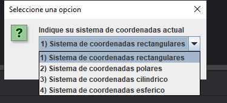

# Calculadora de Coordenadas y Distancias Espaciales

## Creadores
* Francisco Javier Bernal Calvo
* Joaquín Dávila Arenas

## Descripción
Programa desarrollado en Java dentro del entorno IntelliJ IDEA para la conversión de coordenadas entre los sistemas polar, rectangular y esférico, además del cálculo de distancias y transformaciones entre puntos en el espacio.

## Archivos del Proyecto
* `calculadora.java`: Clase principal que contiene el menú y la lógica de ejecución del programa.
* `esferico.java`: Métodos y operaciones para coordenadas esféricas.
* `polar.java`: Métodos y operaciones para sistemas de coordenadas polares.
* `rectangular.java`: Métodos y operaciones para sistemas de coordenadas rectangulares.
* `Transformaciones.java`: Funciones matemáticas para las conversiones entre sistemas de coordenadas.

## Información del Proyecto, Configuraciones e Instrucciones
* **Lenguaje:** Java (JDK 11 o superior).
* **IDE Recomendado:** IntelliJ IDEA (compatible también con NetBeans, Eclipse o VS Code).

### Instrucciones de Configuración y Ejecución
1. Clonar este repositorio o descargar los archivos `.java`.
2. Abrir el proyecto o la carpeta en tu IDE (ej. IntelliJ IDEA).
3. Asegurarse de tener configurado el JDK de Java en el entorno de desarrollo.
4. Compilar y ejecutar el archivo principal **`calculadora.java`**.
5. Seguir las instrucciones en consola para elegir el tipo de conversión o cálculo deseado.

## Imágenes

